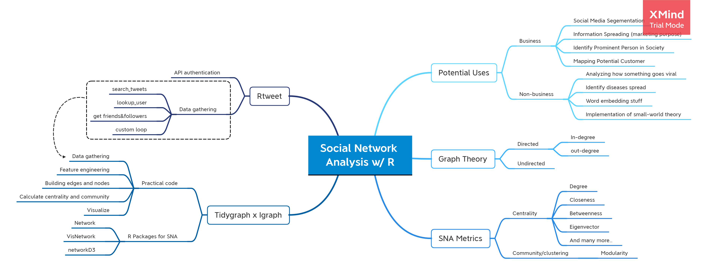
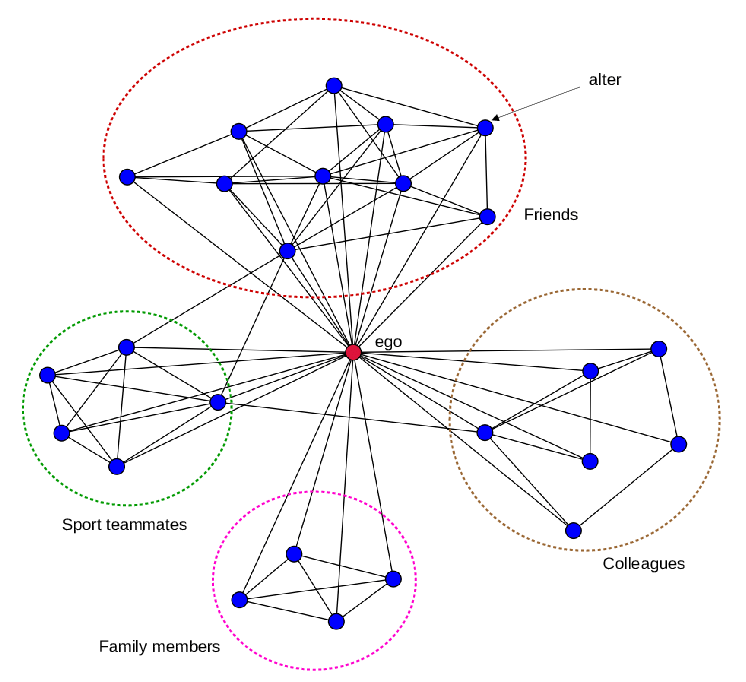
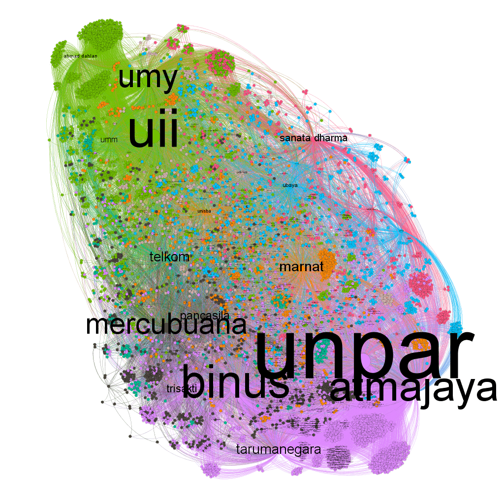

```{r setup, include=FALSE}
knitr::opts_chunk$set(echo = TRUE, 
                      fig.align = "center")

options(scipen = 999)
```


**Hello!**   
Welcome to my first internal training. In this markdown, we will learn about `Social Network Analysis` using `tidygraph` (including `igraph` and `ggraph`). We'll not only learn about the visualizing stuff but also the metrics. We'll analyze Twitter network as our study case using `rtweet` package. After this internal training, I hope we will be able to do:   
   
- Analyze *Ego Network* from specific account/user    
- Analyze *Information Activity Network* from something that goes viral   

**Note:** On 28 March 2019, Kak Eca already deliver a cool internal training about Twitter Interactions using `Twinetverse`. It has a similar idea to this study, we both explain about building networks from Twitter data. The difference in this study is we do not only make visualization but also calculate metrics to achieve the goals for every case (spoiler: we'll do 2 SNA cases). We'll also more focus on how to implement SNA and what it is. This study is theory-driven studies.



# Background {.tabset}
## Introduction
**What is Social Network Analysis (SNA)**    
A social network is a structure composed of a set of actors, some of which are connected by a set of one or more relations. *Social network analysis* work at describing underlying patterns of social structure, explaining the impact of such patterns in behavior and attitudes. Social network analysis has 4 main types of network metrics, namely:     
   
- Network Models: Describe how to model the relationship between users   
- Key Players: To identify the most influential users in the network based on a different context     
- Tie Strength: To measure the strength of a user's relationship   
- Network Cohesion: To measure how cohesive entities in the networks towards network behavior.   

**So what? Why do we need them?**   
Humans are social beings. Even when you sleep, you're still connected to everyone in the world by your smartphone. Your smartphone keeps sending and receive information like weather information, incoming whatsapp messages, late-night One Piece update, and social media notification from your favorite bias. We're always connected and there's network everywhere. Somehow, some smart dudes behind the famous [Small World Theory](https://en.wikipedia.org/wiki/Small-world_network) found something from the network that quite exciting.

Did you know you only [seperates by six steps](https://en.wikipedia.org/wiki/Six_degrees_of_separation) from your favorite person in the world? We are able to quantify the what-so-called network and can be implemented in many fields. In this study, we'll only focus on identify network metrics with `key player` as the expected output (see the 4 main types of network metrics above). Here's some implementation of SNA to enlight your knowledge about SNA a bit: (will put reference links later)

- Business:   
  + [Social media segmentation](https://www.researchgate.net/publication/320653694_Social_network_data_analytics_for_market_segmentation_in_Indonesian_telecommunications_industry)   
  + [Information spreading through network (for marketing purpose)](https://ieeexplore.ieee.org/abstract/document/5076278)  
  + [Identify prominent person of a society (for identify best endorsment)](https://www.researchgate.net/profile/Walter_Kosters/publication/267711959_Identifying_Prominent_Actors_in_Online_Social_Networks_using_Biased_Random_Walks/links/5550870208ae956a5d24d2c2.pdf)   
  + [Mapping potential customer](dl.acm.org/doi/abs/10.1145/1961189.1961194)   
  + [Mapping tourism flow](https://www.tandfonline.com/doi/abs/10.1080/13683500.2014.990422)   
  
- Non-business:   
  + Analyzing how something goes viral in social media   
  + [Identify diseases spread](https://www.sciencedirect.com/science/article/pii/S0167587703000758)   
  + Word embedding stuff   
  + Implementation of small-world theory and Six degree separation of Kevin Bacon   

## Libraries
Let's install required library for this study.
```{r message=FALSE,warning=FALSE}
# for data wrangling. very helpfull for preparing nodes and edges data
library(tidyverse) 
library(lubridate)

# for building network and visualization 
library(tidygraph)
library(graphlayouts)
# already included in tidygraph but just fyi
library(igraph)
library(ggraph)

# for crawling Twitter data 
library(rtweet)
```

# Let's Begin !
## Prerequisites
We'll crawl Twitter data using Twitter's rest API. Thus, we need authentication to use the API. To access the API, you will need to create a Twitter Developer Account here: https://developer.twitter.com/en (make sure you already have Twitter account). Creating a Twitter developer account is simple and tends to be fast but it depend on how you describe what you will do with the API.   

Good news! recent update of `rtweet` allows you to interact with Twitter API without creatin your own Twitter developer account. But it's better if you have one because it gives you more stability and permissions. If you need further explanation, you can head over rtweet’s official website [here](https://rtweet.info/).

In this study, we'll crawl Twitter data without using access token as credentials. but if things are going bad, I provide some access token we can use to crawl the data. **Note:** Due to the rate limit, and most of us will use it at the same time, please use the token wisely.

```{r, eval=FALSE}
apikey <- "A5csjkdrS2xxxxxxxxxxx"
apisecret <- "rNXrBbaRFVRmuHgEM5AMpdxxxxxxxxxxxxxxxxxxxxxxx"
acctoken <- "1149867938477797376-xB3rmjqxxxxxxxxxxxxxxxxxxx"
tokensecret <- "Dyf3VncHDtJZ8FhtnQ5Gxxxxxxxxxxxxxxxxxxxxxx"

token <- create_token(app = "Automated Twitter SNA",
                      consumer_key = apikey,
                      consumer_secret = apisecret,
                      access_token = acctoken,
                      access_secret = tokensecret)

apikey2 <- "rt6vxwIOErhMIAxxxxxxxxxxxxxx"
apisecret2 <- "J16s0Tz9WR9MS8kVETww56apU9exxxxxxxxxxxxxxx"
acctoken2 <- "1149867938477797376-TZNBxxxxxxxxxxxxxxxxxxxxxx"
tokensecret2 <- "Z0ZsZ1yyaBJblVc2n9WHxxxxxxxxxxxxxxxxxxxxxxx"

token2 <- create_token(app = "Twitter Network Identification",
                      consumer_key = apikey2,
                      consumer_secret = apisecret2,
                      access_token = acctoken2,
                      access_secret = tokensecret2)

```

```{r}
# Note: Only run one this code if you cant crawl the data without using any access token
mytoken_1 <- readRDS("data_input/token_1.rds")

#mytoken_2 <- readRDS("data_input/token_2.rds")

# check if the token is active
get_token()
```

## Graph Theory
In mathematics, graph theory is the study of graphs, which are mathematical structures used to model pairwise relations between objects. A graph in this context is made up of **vertices** (also called nodes or points) which are connected by **edges** (also called links or lines). In general, A connection between nodes are separated by 2 types: [Directed and Undirected](https://www.mathworks.com/help/matlab/math/directed-and-undirected-graphs.html). 

- Directed is a relationship between nodes that the edges have a direction (The edges have orientations). You will recognize it as edges that have an arrow in it. Directed network also separated into 2 types based on its direction, namely: in-degree and out-degree. In-degree represents the number of edges incoming to a vertex/node. In below directed graph, In-degree of A is 1 and degree of D is 2. Out-degree represents the number of edges outgoing from a vertex. In below directed graph, out-degree of A is 1 and out-degree of C is 3.
```{r, echo=FALSE}
set.seed(123)
gp <- matrix(sample(0:1, 16, replace=TRUE), nrow=4)
colnames(gp) = rownames(gp) = LETTERS[1:4]
 
# build the graph object
ngp <- graph_from_adjacency_matrix(gp,mode = "directed")
 
# plot it
plot(ngp)
```

- Undirected indicates a two-way relationship, the edges are unidirectional, with no direction associated with them. Hence, the graph can be traversed in either direction. The absence of an arrow tells us that the graph is undirected.
```{r,echo=FALSE}
ngp <- graph_from_adjacency_matrix(gp,mode = "undirected")
plot(ngp)
```


# Case 1: TeamAlgoritma Ego Network
Ego network is a concept indicates the amount of all the nodes to which an ego/node is directly connected and includes all of the ties among nodes in a network. You take any random username/company/person you want to analyze, gather all their neighborhood, and analyze it. sometimes you'll find interesting patterns like this person has a lot of different communities and none of them are look-alike, or you can also found a person who can spread information most widely around your target-person network.

Case objectives:    
- Analyze **Ego Network** from @TeamAlgoritma Twitter account   
  + Visualize top cluster from TeamAlgoritma mutual account   
  + find out which account has the potential to spread information widely   
  + Calculate the metrics, and find out who is the `key player` in TeamAlgoritma network   

Here's the step to do this case:   
1. Gather TeamAlgoritma detail Twitter data   
2. Gather all TeamAlgoritma followers   
3. From the follower, filter to  active account only and gather their follower and following   
4. Create Mutual data from following and follower data   
5. Build communities, Calculate SNA metrics, and identify which user is important   
6. Visualize the ego network   



## Gather @TeamAlgoritma data
```{r}
algo <- lookup_users("teamalgoritma")
algo
```

## Gather TeamAlgoritma followers

```{r}
# get teamalgoritma followers
folower <- get_followers("teamalgoritma",n = algo$followers_count,retryonratelimit = T)

# get the detail from algoritma follower lists
detail_folower <- lookup_users(folower$user_id)
detail_folower <- data.frame(lapply(detail_folower,as.character),stringsAsFactors = F)

detail_folower %>% arrange(-as.numeric(followers_count)) %>% 
  select(screen_name,followers_count, friends_count, favourites_count)
```

TeamAlgoritma Twitter account has 342 followers (on 15 May 2020). We need to gather all of their follower and following but Twitter rest API has (kinda stingy) limitation.
```{r}
rate_limit()
```
We can only gather 15 users (both following and follower) and 5k retrieved for every 15 minutes, so you can imagine if we want to retrieve thousand of them.. In order to minimize the time consumption, we need to filter the users to active users only. The criteria of 'active users' depend on your data. You need to lookup which kind of users your follower is and build your own criteria. In this case, the top 8 of Algoritma's followers is a media account. Accounts like 'btekno' and 'machinelearnflx' only repost link to their own media and never retweet other account tweets. So if our goal is to map the potential information spreading around TeamAlgoritma ego network, we need to exclude them for that reason.    

After a long inspection, i propose several criteria for filtering active account: `Followers_count` > 100 and < 6000, `following_count` > 75, `favourites_count` > 10, and create a `new tweet` at least 2 months ago. I also want to exclude protected accounts because we actually can't do anything about it, we can't gather their following and followers.

```{r, eval=FALSE}
active_fol <- detail_folower %>% 
  select(user_id,screen_name,created_at,followers_count,friends_count,favourites_count) %>%
  mutate(created_at = ymd_hms(created_at),
         followers_count = as.numeric(followers_count),
         friends_count = as.numeric(friends_count),
         favourites_count = as.numeric(favourites_count)) %>%
  filter((followers_count > 100 & followers_count < 6000), friends_count > 75, favourites_count > 10, 
         created_at > "2020-03-15") %>%
  arrange(-followers_count)
```
```{r}
# TeamAlgoritma followers is always changing. we will use data i gathered at 15 may 2020
active_fol <- read.csv("data_input/active_fol.csv")
```


## Gather TeamAlgoritma follower's follower
I build a loop function to gather followers from a list. Actually, we can gather the follower with this simple code
```{r, eval=FALSE}
get_followers(active_fol$screen_name, n = "all",
              retryonratelimit = T)
```

But we want to minimize the total user we want to retrieve (`n` parameter). i build a simple function to retrieve half of the followers if they have more than 1500 followers, and 75% followers if they have less than 1500
```{r}
flt_n <- function(x){
  if(x > 1500){
    x*0.5
  }else{x*0.75}
}
```
We also want to avoid SSL/TLS bug while we gather the followers. Sometimes when you reach the rate limit, the loop tends to crash and stop running. To avoid that, i order the loop to sleep every 5 gathered account (it doesn't always solve the problem, but it way much better)

```{r, eval=FALSE}
# Create empty list and name it after their screen name
foler <- vector(mode = 'list', length = length(active_fol$screen_name))
names(foler) <- active_fol$screen_name

# 
for (i in seq_along(active_fol$screen_name)) {
  message("Getting followers for user #", i, "/130")
  foler[[i]] <- get_followers(active_fol$screen_name[i], 
                                  n = round(flt_n(active_fol$followers_count[i])), 
                                retryonratelimit = TRUE)
  
  if(i %% 5 == 0){
    message("sleep for 5 minutes")
    Sys.sleep(5*60)
    } 
}

```

After gathering, bind the list to dataframe, convert the username to user_id by left_join from active_fol data, and build clean data frame without NA
```{r, eval=FALSE}
# convert list to dataframe
folerx <- bind_rows(foler, .id = "screen_name")
active_fol_x <- active_fol %>% select(user_id,screen_name)

# left join to convert screen_name into its user id
foler_join <- left_join(folerx, active_fol_x, by="screen_name")

# subset to new dataframe with new column name and delete NA
algo_follower <- foler_join %>% select(user_id.x,user_id.y) %>%
  setNames(c("follower","active_user")) %>% 
  na.omit()
```

The loop need a looong time to be done. To speed up our progress, i already gather the followers and we'll use it for analysis.

```{r}
algo_follower_df <- read.csv("data_input/follower_algo.csv") 
```

## Gather TeamAlgoritma follower's following
Same as before, we build a loop function to gather the following. in `rtweet` package, following is also called as `friend`.
```{r}
active_fol %>% arrange(-friends_count)
```
As you can see, friends_count is way more higher than followers_count. Thus, we need to specify how many users we want to retrieve (`n` parameter). We want to minimize it, i change `flt_n` function to gather only 40% if they have more than 2k following, and 65% if less than 2k.

```{r}
flt_n_2 <- function(x){
  if(x > 2000){
    x*0.4
  }else{x*0.65}
}
```

The loop is also a bit different. instead of list, we store the data to dataframe. `get_friends()` function gives 2 columns as their output; friend list and the query. we can easily just row bind them.
```{r, eval=FALSE}
friend <- data.frame()

for (i in seq_along(active_fol$screen_name)) {
  message("Getting followers for user #", i, "/161")
  kk <- get_friends(active_fol$screen_name[i],
                        n = round(flt_n_2(active_fol$friends_count[i])),
                        retryonratelimit = TRUE)
  
  friend <- rbind(friend,kk)
  
  if(i %% 5 == 0){
    message("sleep for 5 minutes")
    Sys.sleep(5*60)
    } 
}

```

```{r, eval=FALSE}
all_friend <- friend %>% setNames(c("screen_name","user_id"))
all_friendx <- left_join(all_friend, active_fol_x, by="screen_name")

algo_friend <- all_friendx %>% select(user_id.x,user_id.y) %>%
  setNames(c("following","active_user"))
```

This loop also takes a long time to run. Again, to speed up our progress, we will use the following data i already gathered.

```{r}
algo_friend_df <- read.csv("data_input/following_algo.csv")
```

We need to make sure all unique active user in algo_friend is available in algo_following and vice versa
```{r}
algo_friend_df %>% filter(!active_user %in% algo_follower_df$active_user)
```

## Create Mutual dataframe
Now we have both following and follower data. We need to build 'mutual' data to make sure the network is a strong two-side-connection network. Mutual is my terms of people who follow each other. we can found that by: split algo_friend data by every unique active_user, then we find every account in the following column that also appears in algo_follower$follower. The presence in both column indicates the user is following each other

```{r}
# collect unique user_id in algo_friend df
un_active <- unique(algo_friend_df$active_user) %>% data.frame(stringsAsFactors = F) %>%
  setNames("active_user")

# create empty dataframe
algo_mutual <- data.frame()

# loop function to filter the df by selected unique user, then find user that presence 
# in both algo_friend$following and algo_follower$follower column
# set column name, and store it to algo_mutual df

for (i in seq_along(un_active$active_user)){
  aa <- algo_friend_df %>% filter(active_user == un_active$active_user[i])
  bb <- aa %>% filter(aa$following %in% algo_follower_df$follower) %>%
    setNames(c("mutual","active_user"))
  
  algo_mutual <- rbind(algo_mutual,bb)
}

```

It isn't done yet. this is an ego network for TeamAlgoritma account, we want that account to appear on our screen. since TeamAlgoritma barely follows back its followers, it's not a surprise if we can't found it in mutual dataframe 
```{r}
# check if TeamAlgoritma is presence
algo_mutual %>% filter(mutual == "943736953274482688")
```

So we need to add them manually. we already have un_active dataframe contain unique value of active users. we can simply add extra column contain 'TeamAlgoritma" then bind them with algo_mutual df
```{r}
un_active <- un_active %>% mutate(mutual = rep("TeamAlgoritma"))
# swap column oreder
un_active <- un_active[,c(2,1)]

# rbind to algo_mutual df
algo_mutual <- rbind(algo_mutual,un_active)

algo_mutual
```

phew, we finished the data gathering step! next, we'll jump into SNA process

## Build nodes, edges, and graph dataframe
A network consists of nodes and edges. nodes (also called vertices) indicates every unique object in network and edges is a relation between nodes (object). We'll build nodes dataframe from every unique account in algo_mutual df. and edges dataframe that contains pair of accounts, we can use algo_mutual df for that.

```{r}
nodes <- data.frame(V = unique(c(algo_mutual$mutual,algo_mutual$active_user)),
                    stringsAsFactors = F)
```

```{r}
edges <- algo_mutual %>% setNames(c("from","to"))

```

after that, we can simply create graph dataframe using `graph_from_data_frame` function from `igraph` package.
```{r}
network_ego1 <- graph_from_data_frame(d = edges, vertices = nodes, directed = F) %>%
  as_tbl_graph()
```

## Build communities and calculate metrics
I need to remind you we'll do the analysis using `tidygraph` style. There are lots of different code styles to build a network but i found `tidygraph` package is the easiest. `tidygraph` are just wrappers for `igraph` packages.

`igraph` code example:
```{r, eval=FALSE}
# build communities and its member from graph
cw <- cluster_walktrap(network_ego1)
member <- data.frame(v = 1:vcount(network_ego1), member = as.numeric(membership(cw)))

# measure betweenness centrality using igraph
V(network_ego1)$betwenness <- betweenness(network_ego1, v = V(network_ego),directed = F)
```

Create communities using `group_walktrap()` algorithm, and calculate lots of metrics using `tidygraph` style 
```{r}
set.seed(123)
network_ego1 <- network_ego1 %>% 
  mutate(community = as.factor(group_walktrap())) %>%
  mutate(degree_c = centrality_degree()) %>%
  mutate(betweenness_c = centrality_betweenness(directed = F,normalized = T)) %>%
  mutate(closeness_c = centrality_closeness(normalized = T)) %>%
  mutate(eigen = centrality_eigen(directed = F))

network_ego1
```
 
We can easily convert it to dataframe using `as.data.frame()` function. We need to this to specify who is the `key player` in TeamAlgoritma ego network
```{r}
network_ego_df <- as.data.frame(network_ego1)
network_ego_df
```

## Graph Metrics
Before we make a conclusion from the table above, let's take a time to learn what's the idea behind those metrics. We'll build a network from Algoritma Product Team as dummy network to make the explanation easier, and just to inform you how SNA works in real case
```{r}
product_df <- read.csv("data_input/product_exnet.csv",stringsAsFactors = F)

nodes_dum <- data.frame(V = unique(c(product_df$from,product_df$to)),
                        stringsAsFactors = F)
edge_dum <- product_df

product_net <- graph_from_data_frame(d = edge_dum, vertices = nodes_dum, directed = T) %>%
  as_tbl_graph()

```
```{r message=FALSE,warning=FALSE}
library(extrafont)
loadfonts(device = "win")
# windowsFonts()
```

### Degree Centrality   
The easiest centrality among them all. It's just **how many ties that a node has**. The calculation for directed and undirected are kinda different but it has the same idea: how many nodes are connected to a node. 

```{r}
product_net %>% 
  mutate(degree = centrality_degree(mode = "in")) %>%
  ggraph(layout = "fr") +
  geom_edge_fan(alpha = 0.25) +
  geom_node_point(aes(size = degree,color = degree)) +
  geom_node_text(aes(size = degree,label = name),
                 repel = T,show.legend = F) +
  scale_color_continuous(guide = "legend") +
  theme_graph() + labs(title = "Product Team Network",
                       subtitle = "Based on Degree Centrality")

```

```{r}
# Tiara network neighbors
g_ti <- induced.subgraph(product_net, c(2, neighbors(product_net,2)))
g_ti %>% plot(edge.arrow.size = 0.5,layout = layout.star(g_ti,center = V(g_ti)[1]))
```


### Closeness centrality
The closeness centrality of a node is the **average length of the shortest path** between the node and all other nodes in the graph. Thus the more central a node is, the closer it is to all other nodes.
$$C(i) = \frac{N-1}{\sum_{j}d(j,i)}$$
$d(j,i)$ is the distance between vertices $j$ and $i$. This centrality divide total number of nodes minus 1($N-1$) by total number of every shorthest path between one node to every node in the graph.

```{r}
product_net %>% 
  mutate(closeness = centrality_closeness()) %>%
  ggraph(layout = "nicely") +
  geom_edge_fan(alpha = 0.25) +
  geom_node_point(aes(size = closeness,color = closeness)) +
  geom_node_text(aes(size = closeness, label = name),
                 repel = T, show.legend = F) +
  scale_color_continuous(guide = "legend") +
  theme_graph() + labs(title = "Product Team Network",
                       subtitle = "Based on Closeness Centrality")

```

### Betweenness centrality
Betweenness centrality quantifies the number of times a node acts as a bridge along the shortest path between two other nodes/groups.  
$$C_{B}(v) = \sum_{ij}\frac{\sigma_{ij}(v)}{\sigma_{ij}}$$
Where $\sigma_{ij}$ is total number of shortest paths from node $x$ to node $y$ and $\sigma_{ij}(v)$ is the number of those paths that pass through $v$ 

```{r}
product_net %>% 
  mutate(betweenness = centrality_betweenness()) %>%
  ggraph(layout = "kk") +
  geom_edge_fan(alpha = 0.25) +
  geom_node_point(aes(size = betweenness,color = betweenness)) +
  geom_node_text(aes(size = betweenness, label = name),
                 repel = T, show.legend = F) +
  scale_color_continuous(guide = "legend") +
  theme_graph() + labs(title = "Product Team Network", 
                       subtitle = "Based on Betweenness Centrality")

```

### Eigenvector centrality
Eigenvector centrality is a measure of the influence of a node in a network. The relative score that is assigned to the nodes in the network is based on the concept that **connections to high-scoring contributes more to the score** of the node in question than equal connections to low-scoring nodes. This amazing [link](http://matrixcalc.org/en/vectors.html) will help you with the calculation.

if $A$ is the adjency matrix of a graph and $\lambda$ is the largest eigenvalue of $A$ and $x$ is the corresponding eigenvector then $Ax = \lambda x$. it can be transformed to $x = \frac{1}{\lambda}Ax$. where $Ax$ can be defined $\sum_{j=1}^{N}A_{i,j}x_{j}$ therefore:
$$C_{E}(i) = x_{i} = \frac{1}{\lambda}\sum_{j=1}^{N}A_{i,j}x_{j}$$


```{r}
product_net %>% 
  mutate(eigen = centrality_eigen()) %>%
  ggraph(layout = "nicely") +
  geom_edge_fan(alpha = 0.25) +
  geom_node_point(aes(size = eigen,color = eigen)) +
  geom_node_text(aes(size = eigen, label = name),
                 repel = T, show.legend = F) +
  scale_color_continuous(guide = "legend") +
  theme_graph() + labs(title = "Product Team Network",
                       subtitle = "Based on Eigenvector Centrality")

```

### Community and Modularity
Building community in graph theory is a bit different than clustering in machine learning.`igraph` package implements a number of community detection methods, community structure detection algorithms try to find dense subgraphs in directed or undirected graphs, by optimizing some criteria and usually using heuristics. Community detection algorithm like `group_walktrap()`, `group_fast_greedy()`, and `group_louvain()` has their own way to create communities in the network. One of the common use community detection algorithm is `group_walktrap()`. This function tries to find densely connected subgraphs, also called communities in a graph via random walks. The idea is that short random walks tend to stay in the same community. 

Modularity in the other hand, is a measure of how good the division is, or **how separated are the different vertex types from each other**
$$Q = \frac{1}{2m}\sum_{ij}(A_{ij}-\frac{k_{i}k_{j}}{2m})\delta(c_{i},c_{j})$$
here $m$ is the number of edges, $A_{ij}$ is the element of the $A$ adjacency matrix in row $i$ and column $j$, $k_{i}$ is the degree of $i$, $k_{j}$ is the degree of $j$, $c_{i}$ is the type (or component) of $i$, $c_{j}$ that of $j$, and $\delta(c_{i},c_{j})$ is the Kronecker delta, which returns 1 if the operands are equal and 0 otherwise. In summary, **networks with high modularity have dense connections between the nodes within community but sparse connections between nodes in different community**

```{r}
product_net %>% 
  mutate(community = group_walktrap()) %>%
  ggraph(layout = "nicely") +
  geom_edge_fan(alpha = 0.25) +
  geom_node_point(aes(color = factor(community)),size = 5, show.legend = F) +
  geom_node_text(aes(label = name),repel = T) +
  theme_graph() + theme(legend.position = "none") +
  labs(title = "Product Team Network", subtitle = "Seperated by cluster")
```
Now let's check if this network has high or low modularity score
```{r}
# first build communities using any cluster detection algorithm
cw_net <- igraph::cluster_walktrap(product_net)
modularity(cw_net)
```
low modularity score indicates the community in the network actually don't have much difference. There are dense connections between nodes in both communities. The community member might be different depends on what algorithm you use. you can try different algorithms and compare them using `compare()` function. By default, `compare()` returns a score by its Variance Information (method = "vi), which counts whether or not any two vertices are members of the same community. A lower score means that the two community structures are more similar 

```{r}
sp_net <- cluster_spinglass(product_net)
compare(comm1 = cw_net,comm2 = sp_net,method = "vi")
```


## Identify prominent user in the network
So at this point, i hope you understand the concept of graph, nodes & edges, centrality, community & modularity, and how to use it. We will move back to our Twitter network. We already convert the table_graph to data frame. Last thing we need to do is to find top account in each centrality and pull the key player
```{r}
network_ego_df
```

Key player is a term for the most influential users in the network based on different contexts. 'Different context' in this case is different centrality metrics. Each centrality have different use and interpretation, a user that appears in the top of most centrality will be considered as the key player of the whole network.

```{r}
kp_ego <- data.frame(
  network_ego_df %>% arrange(-degree_c) %>% select(name) %>% slice(1:6),
  network_ego_df %>% arrange(-betweenness_c) %>% select(name) %>% slice(1:6),
  network_ego_df %>% arrange(-closeness_c) %>% select(name) %>% slice(1:6),
  network_ego_df %>% arrange(-eigen) %>% select(name) %>% slice(1:6)
) %>% setNames(c("degree","betweenness","closeness","eigen"))

kp_ego
```

From the table above, account "1049333510505291776" appears in most centrality. That account has the most degree in the network (high degree) but also surrounded by important persons (high eigenvector). TeamAlgoritma is an exception, that's our ego query so it isn't wise to make it as a key player in its own ego network. We can conclude that user "1049333510505291776" is the key player of TeamAlgoritma Twitter ego network.


**Note:** after lots of troubleshooting, it seems that user-id "1049333510505291776" has been changed to "1049333510505291778". I use old data when i do this analysis (15Mmay 2020) and twitter user-id is changed over time. 
Let's see who he/she is:
```{r}
key_player_ego <- lookup_users("1049333510505291778")
key_player_ego
```

## Visualize Network
Let's try to visualize the network. I'll scale the nodes by degree centrality, and color it by community. since our network is too large (approximately 14k nodes and 15k edges), i'll filter by only showing community 1 - 3. 

```{r, eval=FALSE}
plot_ego <- network_ego1 %>%
  filter(community %in% 1:3) %>%
  top_n(1000,degree_c) %>%
  mutate(node_size = ifelse(degree_c >= 20,degree_c,0)) %>%
  mutate(node_label = ifelse(betweenness_c >= 0.06,name,"")) %>%
  ggraph(layout = "stress") +
  geom_edge_fan(alpha = 0.05) +
  geom_node_point(aes(color = as.factor(community),size = node_size)) +
  geom_node_label(aes(label = node_label),repel = T,
                 show.legend = F, fontface = "bold", label.size = 0,
                 segment.colour="slateblue", fill = "#ffffff66") +
  coord_fixed() +
  theme_graph() + theme(legend.position = "none") +
  labs(title = "TeamAlgoritma Mutual Communities",
       subtitle = "Top 3 Community")

saveRDS(plot_ego,"plotego.rds")
```
This process take 30-40 minutes in my pc. i save the plot in rds file to speed up our process
```{r, fig.width=8, fig.height=8}
plot_ego1 <- readRDS("data_input/plotego.rds")
plot_ego1
```

What can we get from this visualization?
This obviously doesn’t tell much of a story (we need further inspection in the data, matching it to the visualization), but it shows that the “random walk” community detection algorithm is picking up on the same structure as "stress" layout algorithm. TeamAlgoritma as our ego appears in the middle, act as a bridge who connects all cluster. we only show user label who has high betweenness centrality value. a mushroom-shaped nodes behind them are their mutual friends who don't follow TeamAlgoritma account. That user is our potential reader if their 'bridge' retweeting or mentioning something about TeamAlgoritma account. user in the same community or who close to each other maybe know each other in real life. they create their own community. The key player is in community #1 (red), which is TeamAlgoritma's most important community because they have the most potential to spread information fast and widely. 

# Case 2: Activity Network
Activity network analyzes how information is spread around the network. From this analysis, we can found how something goes viral and how people interact with it. Because this network contains all forms of Twitter communication (even a single retweet), the visualization will most likely become a hairball. You will need a lot of data featuring or filtering for visualization purposes, but in the end it will be up to your preferences.   

## Case Objective
- Analyze **Activity Network** given random keyword(s) or hashtag   
  + Visualize the activity/information network   
  + find out which cluster talk about which topic regarding the keyword   
  + Calculate the metrics, and find out who is the `key player` in the whole conversation network   

Here's the step to do this case:   
1. Gather any trending keywords or hashtag (in this case i'll use #NewNormal)   
2. Filter the data, use tweet with lots of interaction (retweet or mention)   
3. Specify which column is communicating with which, then create edges df   
4. Create nodes df and the network   
5. Build communities, Calculate SNA metrics, and identify which user is important   
6. Visualize the network    

## Gather tweets data
You can always choose other keywords or hashtags. in this example, i'll use #NewNormal as the query.
```{r, eval=FALSE}
newnorm <- search_tweets("#NewNormal",n = 18000,include_rts = T,retryonratelimit = T)
newnorm <- data.frame(lapply(newnorm,as.character),stringsAsFactors = F)
```
it'll take approximately 4-5 minutes and there's a possibility of failure (sls/tls, or simply bad connection). so i provide the output in csv for us to continue the analysis.

```{r}
newnorm <- read.csv("data_input/newnormal.csv", stringsAsFactors = F)
head(newnorm)
```

## Build edges, nodes, and graph dataframe
mentions_screen_name column contains user screen_name we interact with. it'll be our "to" column in edges. however, by default the column is list type (that i convert to character). We need to remove unused string first. Here's a function to remove all symbols except letter, number and comma ' , '. it also remove first letter in the string (c in our case)
```{r}
mention_clean <- function(x){
  if(grepl(",",x) == TRUE){
    gsub('^.|[^[:alnum:][:blank:]_,?&/\\-]',"",x)
  } else{
    x
  }
}
```

then we simply apply it to the column
```{r}
# apply mention_clean function to mentions_screen_name column using sapply()
edge_nn <- newnorm %>% select(screen_name,is_retweet,mentions_screen_name) %>%
  mutate(mentions_screen_name = sapply(mentions_screen_name,mention_clean))

# specify interaction type
edge_nn <- edge_nn %>% 
  mutate(type = ifelse(is_retweet == "TRUE","retweet","mention"))

# seperate value in mention_screen_name by comma
edge_nn <- edge_nn %>% select(screen_name,mentions_screen_name,type) %>%
  separate_rows(mentions_screen_name,sep = ",") %>% 
  setNames(c("from","to","type")) %>% count(from,to,type)

# create nodes dataframe by unique value in both edges column
nodes_nn <- data.frame(V = unique(c(edge_nn$from,edge_nn$to)),
                        stringsAsFactors = F)

# build graph data
network_nn <- graph_from_data_frame(d = edge_nn, vertices = nodes_nn, directed = T) %>%
  as_tbl_graph()

# create community, calculate centrality and remove loop edge
set.seed(123)
network_nn <- network_nn %>% 
  activate(nodes) %>%
  mutate(community = group_walktrap(),
         degree = centrality_degree(),
         between = centrality_betweenness(),
         closeness = centrality_closeness(),
         eigen = centrality_eigen()) %>%
  activate(edges) %>%
  filter(!edge_is_loop())

network_act_df <- as.data.frame(network_nn %>% activate(nodes))

network_nn
```

## Identify a prominent person in the network
Key players in the ego network and activity network have different interpretation. In this case, the key player will be considered as a person who makes this specific keyword viral. We also can identify which person whose opinions are widely agreed upon by others. 

```{r}
kp_activity <- data.frame(
  network_act_df %>% arrange(-degree) %>% select(name) %>% slice(1:6),
  network_act_df %>% arrange(-between) %>% select(name) %>% slice(1:6),
  network_act_df %>% arrange(-closeness) %>% select(name) %>% slice(1:6),
  network_act_df %>% arrange(-eigen) %>% select(name) %>% slice(1:6)
) %>% setNames(c("degree","betweenness","closeness","eigen"))

kp_activity
```
We got interesting results here. every top centrality has a different account. It means every top user is great in their own 'job' on the network. we can tell that there's no super user in #NewNormal network. From the table above, "adrianoqalbi" grab my attention the most. he appears in 2 centrality (if we remove NA in eigenvector centrality). Thus we can conclude he is the key player in #NewNormal Twitter activity network. Let's see his tweets
```{r}
newnorm %>% filter(screen_name == "adrianoqalbi") %>% arrange(-retweet_count)
```

## Visualize network
let's try to visualize the network. the network consist of 23k+ nodes and  17k+ degree. we need to filter it otherwise it'll be just hairball of nodes and edges. here i just plot top 3 community and filter the label by nodes with degree centrality >= 3 or betweenness centrality >= 100. The edges color are separated  by interaction type.

```{r, fig.width=8, fig.height=8}
network_nn %>%
  activate(nodes) %>%
  mutate(ids = row_number()) %>%
  filter(community %in% 1:3) %>% arrange(community,ids) %>%
  mutate(node_label = ifelse(degree >= 3 | between >= 5,name,"")) %>%
  mutate(node_size = ifelse(degree >= 3 | between >= 5,degree,0)) %>%
  ggraph(layout = "linear", circular = T) +
  geom_edge_arc(alpha = 0.05, aes(col = as.factor(type), edge_width = n*0.5)) +
  geom_node_label(aes(label = node_label, size = node_size),repel = T,
                 show.legend = F, fontface = "bold", label.size = 0,
                 segment.colour="slateblue", fill = "#ffffff66") +
  coord_fixed() + 
  labs(title = "Twitter Activity Network #NewNormal",
       subtitle = "Retweets and mention between 3 top communities") +
  theme_graph() + 
  guides(edge_width = F,
         edge_colour = guide_legend(title = "Tweet Type",
                                    override.aes = list(edge_alpha = 1))) +
  theme(legend.position = "bottom", plot.title = element_text(size = rel(2)),
        plot.subtitle = element_text(size = rel(1)),
        legend.text = element_text(size = rel(1)))
  
```

What can we get from this visualization?
First, lets see this table
```{r}
network_act_df %>% arrange(-degree) %>%
  group_by(community) %>% slice(1:5)
```
Now we can identify which person belongs to which community based on highest degree. The plot is arranged by community and id (row number), so user in the same community are placed near to each other. community #1 (highest community by frequency) is the only community with 2 interaction types. lots of them are retweeting (or quoting) "adrianoqalbi" tweet, and the others are people who mention "ari_maj" in their tweets. Users in community #2 and #3 are just retweeting each other, or maybe some of them make a quote tweet that also goes viral. There's a news account like (detikcom) in community #3, it'll be our evidence that those communities are driven by retweet. I can conclude that the top 3 community (by highest frequency) in Twitter activity network is well separated by its tweet types (interaction types). maybe there's another interesting insight in another community since it creates fewer accounts by each community.


# Additional business case: Competition network 
Competition network gathers all person/user who has connection to specific official account. The main idea is mapping the whole network of accounts in the same industry. for example, we want to see marketing competition in Indonesian private colleges. We gather all of their followers and from that follower, gather all their following. Build community and calculate the metrics, thus we will get important persons who has information from all competing accounts. we also can found which community is a potential 'unreached' market to several companies and how to reach them. 



The graph above shows 21 Indonesian private college Instagram admission of new student network. The network is separated by 3 community, green for Muslim college, purple for Catholic/Christian college, and fuzzy cluster in the middle is what we can say as a 'neutral' college. We can conclude that these days people still looking for education based on their religion. Let's say we're a social media analyst from Binus, then we can find out how to reach UII/UMY/UMM cluster based on important person in their community (endorsement). It will give Binus a lot of engagement right?

Well, the problem is Twitter rate limitation makes it impossible to do this analysis in a short time. So i'll tell you how to do it. It's pretty simple, but takes a loong time:   

1. Select several accounts in the same industry   
2. Gather all of their followers    
3. From the follower, gather all of their following   
4. Filter to active user only (if possible)   
5. Build a network, create community and centrality   
6. Identify prominent user based on your case   
7. Visualize   

Case Objectives:   

- Analyze **Competition Network** from (for example) @kfc_id, @mcd_id, @wendys, @phd account   
  + Visualize the whole competition network    
  + Identify fanbase cluster in each account   
  + Calculate the metrics, and find out who is the `key player` in the whole network   
   
 

# Reference
**SNA with R:**   
- [Rtweet homepage](https://rtweet.info/)   
- [Tidygraph introduction](https://www.data-imaginist.com/2017/introducing-tidygraph/)  
- [Tidygraph introduction 2](http://mr.schochastics.net/netVizR.html)   
- [R Twitter network example (my main reference)](https://perrystephenson.me/2018/09/29/the-r-twitter-network/)   
- [Various R packages for SNA](https://www.jessesadler.com/post/network-analysis-with-r/)   
- [igraph manual pages](https://igraph.org/r/doc/)   
- [R-graph gallery](https://www.r-graph-gallery.com/network.html)   
   

**Thank you !**


